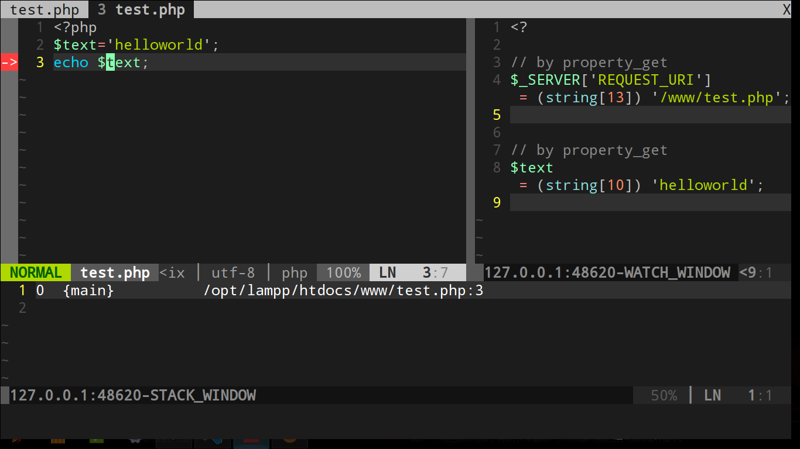
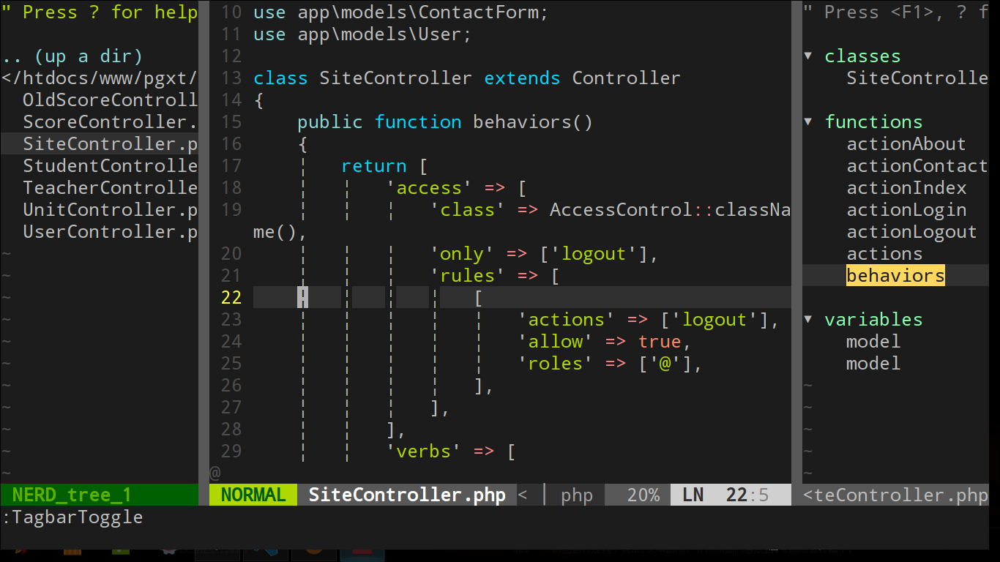

# 第一部分 开发前的准备

<pre>
<p>
“合抱之木，生于毫末；九层之台， 起于累土；千里之行，始于足下”
</p>
<p style="text-align: right;">
———— 老 子
</p>
</pre>
## 第一章 Linux Deepin下yii2运行平台搭建

* 原作者：oschina网友-[不避风云](http://my.oschina.net/bubifengyun)

* 原网址：[http://my.oschina.net/bubifengyun/blog/469235](http://my.oschina.net/bubifengyun/blog/469235)

* <span style="text-decoration: line-through;">GitHub</span>

部分内容有改动。

### 引言

Yii1.1的搭建过程见[这里](http://my.oschina.net/bubifengyun/blog/342130)。下面做少许改动，加入`composer`部分，使之用于Yii2。

选择Linux桌面环境Deepin2014.3下开发网站的理由很简单，能截图，有搜狗输入法，可以WPS文档记录，终端下复制粘贴很容易，相比ubuntu,fedora死机次数少了，对，就是不用折腾，自带的。

### 一、vim和DBGp插件

Deepin2014.3简体中文，自带的vim7.4版本，很多配置已经很适合大陆的人使用了，比如Php和Python的调试支持等，不需要重新编译了。可以节省不少步骤。

这里([http://my.oschina.net/bubifengyun/blog/163516](http://my.oschina.net/bubifengyun/blog/163516))提供一个vim的配置文件，已经自带了DBGp这个vim的插件，在~文件夹下解压缩，得到`.vim`和`.vimrc`文件，就已经在~文件夹下了。 注意，复制之前做好你文件的备份，复制完毕后，命令

```bash
$ ll ~
```

查看是否有`.vim` `.vimrc`这两个文件，还需要安装一下`cscope`和`ctags`，就可以了。你用vim随便打开一个文件，比如

```bash
$ vim test.php
```

，如果没有提示其他错误说明这个配置文件暂时适合你了。

### 二、xampp

xampp专为php开发设计，需要的apache，mysql，php已经自带了。特别提醒，请下载PHP版本高于5.4支持Yii2.0的xampp。 这个网上很容易下到xampp for linux的版本，我下载的就是xampp-linux-x64-<>-install.run的文件 ，使用

```bash
$ sudo <path-to>/xampp-linux-x64-<>-install.run
```

就可以了（如果没有执行权限，自己加
`$ chmod a+x <path-to>/xampp-linux-x64-<>-install.run`
）。下面基本是傻瓜式安装。

安装好后，如果没有启动，可以采用如下命令启动。

```bash
$ sudo /opt/lampp/lampp restart
```

或者提示你启动成功了，你可以打开浏览器，在地址栏输入 `localhost` 回车，应该会跳转到[http://localhost/xampp/](http://localhost/xampp/)，如跳转成功则说明你安装 xampp 成功了。

需要注意一下几点，你的网站的根目录在 `/opt/lampp/htdocs`。 也就是说，你的`xxx.php`文件要想被浏览器解析，必须放到 `/opt/lampp/htdocs` 下。 或者说 http://localhost/ 就是 /opt/lampp/htdocs/ 文件。 例如你在 /opt/lampp/htdocs/ 下新建了一个文件夹www，其下有xxx.php文件，也就是 /opt/lampp/htdocs/www/xxx.php 是这个文件， 你如果想在浏览器里查看这个`xxx.php`，就可以在浏览器里输入 `http://localhost/www/xxx.php` 了。php具体教程网上或者其他书籍上很多。这里不再赘述。

### 三、xdebug

最新版的xampp自带了xdebug.so文件。你可以采用如下命令查找。

```bash
$ sudo find /opt/lampp -name xdebug.so
```

你可以看到类似`/opt/lampp/lib/php/extensions/no-debug-non-zts-20131226/xdebug.so`的文件。


### 四、配置php.ini文件

下面参照这里，对应 xampp，可以使用如下几个步骤来配置。

* 1 root权限打开编辑xampp的`php.ini`文件，`/opt/lampp/etc/php.ini`

```bash
$ sudo vi /opt/lampp/etc/php.ini
```

当然你也可以使用其他编辑器打开。

* 2 在文中搜索zend_extension，应该可以看到有一条注释掉的代码，如下

```
;zend_extension=opcache.so
```

或者其他的比如

```
; Module Settings ;
```

的东西，我是在

```
;zend_extension=opcache.so
<这两行代码之间，插入代码>
; Module Settings ;
```

插入的代码如下：<span style="color: rgb(255, 0, 0);">下面这段xdebug的配置有待优化</span>

```
zend_extension=/opt/lampp/lib/php/extensions/no-debug-non-zts-20131226/xdebug.so
; should be your file name

[debug]
; Remote settings
xdebug.remote_autostart=on
;i dislike input ?XDEBUG_SESSION_START=1 in web
xdebug.remote_enable=on
xdebug.remote_handler=dbgp
xdebug.remote_mode=req
xdebug.remote_host=localhost
xdebug.remote_port=9000
;this 9000 is from debugger.vim

; General
xdebug.auto_trace=off
xdebug.collect_includes=on
xdebug.collect_params=off
xdebug.collect_return=off
xdebug.default_enable=on
xdebug.extended_info=1
xdebug.manual_url=http://www.php.net
xdebug.show_local_vars=0
xdebug.show_mem_delta=0
xdebug.max_nesting_level=100
;xdebug.idekey=

; Trace options
xdebug.trace_format=0
xdebug.trace_output_dir=/tmp
xdebug.trace_options=0
xdebug.trace_output_name=crc32

; Profiling
xdebug.profiler_append=0
xdebug.profiler_enable=0
xdebug.profiler_enable_trigger=0
xdebug.profiler_output_dir=/tmp
xdebug.profiler_output_name=crc32
```

* 3 保存退出。

* 4 重启apache,我是采用如下命令:

```bash
$ sudo /opt/lampp/lampp restart
```

### 五、一个简单的调试例子

下面默认你已经打开apache了。如果未打开，

```bash
$ sudo /opt/lampp/lampp restart
```

参考文献：[https://github.com/brookhong/DBGPavim](https://github.com/brookhong/DBGPavim)

* 1 在`/opt/lampp/htdocs/`文件夹下，新建一个文件夹`www`，

```bash
$ sudo mkdir /opt/lampp/htdocs/www
```

把他改为自己的文件夹。

```bash
$ sudo chown <my-user-name> /opt/lampp/htdocs/www
```

* 2 新建一个文件`test.php`

```bash
$ vim /opt/lampp/htdocs/www/test.php
```

输入如下代码

```php
<?php
$text='helloworld';
echo $text;
```

* 3 在`echo`那行，vim命令模式下:w保存，:Bp设置断点，F5运行。

* 4 打开浏览器输入 [http://localhost/www/test.php](http://localhost/www/test.php)，回车。

* 5 切换回到vim的界面。可能需要按F5，进入调试界面，把光标移到`$text`（两个中的任意一个），按F12，应该可以看到`$text`的内容了。如下图。



* 6 F2,F3为单步调试，有点小区别，自己感受吧。

### 六、安装composer

* 1 创建PHP的系统链接。这里假设你电脑没有直接安装PHP，只有 /opt/lampp/bin 里面有php程序。

```bash
$ sudo ln -s /opt/lampp/bin/php /usr/local/bin/php
```

* 2 安装`composer` 安装的方法有很多，下面介绍一种。

直接在线安装的。

```bash
$ cd /opt/lampp/bin
$ sudo curl -sS https://getcomposer.org/installer | php
```

该安装可能会爆出问题，部分解决方案见本章附录。

* 3 创建composer系统链接

```bash
$ sudo ln -s /opt/lampp/bin/composer.phar /usr/local/bin/composer
```

`composer`命令就安装好了。

### 七、Yii2框架的使用和调试

说实在的composer的安装太头疼了。网速很慢。强烈建议采用直接下载安装包，然后在网站根目录下解压缩，最后再配置composer用来更新部分插件。为了以后方便，下面按部就班的做记录。

切换到网站根目录（xampp的为`/opt/lampp/htdocs/`),本人一直习惯在下面再建一个文件夹叫www,详细说明见上文。

```bash
$ cd /opt/lampp/htdocs/www/
$ composer global require "fxp/composer-asset-plugin:1.0.0"
```

接下来下载basic,其实我更愿意直接下载basic的压缩包，然后解压缩在这里。为了不必要的装，下面用`composer`一把。

```bash
$ composer create-project yiisoft/yii2-app-basic basic 2.0.4
```

如果不出错，等段时间应该会有这样的字样跳出。

```
    Could not fetch https://api.github.com/repos/RobinHerbots/jquery.inputmask/contents/bower.json?ref=4551607fef63fd4bcd675479a8c347b668b915eb, please create a GitHub OAuth token to go over the API rate limit
    Head to https://github.com/settings/tokens/new?scopes=repo&description=Composer+on+litianci-pc+2015-06-21+1655
    to retrieve a token. It will be stored in "/home/litianci/.composer/auth.json" for future use by Composer.
    Token (hidden):
```

看英文的意思是： 给你了一个网址(Head to 后面的是网址)，让你去这个网址用自己的github账号登录，得到一个令牌数，再回来吧这个令牌数贴在下面。 还特别提示你这个令牌数贴进去的时候是看不到的。按着他们说的做，就可以继续进行下去了。

简单的调试一下。

网上，yii的论坛实在资料太丰富了，随便做网站。使用vim+xampp+xdebug+dbgp类调试php,yii 框架，现在就容易多了。

下面做个说明。

比如想调试`./protected/controllers/Helloworld.php`文件下的actionHelloworld()函数里面的部分语句，可以光标停留在这一行，
点击F9或者vim命令行:Bp在这里设置断点，然后点击F5运行。 

跳转到浏览器，打开某个网页会调用`actionHelloworld`函数的，浏览器应该会卡在这里。

回到vim的代码界面，点击F2等逐步调试就可以了。

<hr/>

### 附录 安装composer部分可能出现的问题解决方案

当输入命令

```bash
$ sudo curl -sS https://getcomposer.org/installer | php
```

直接安装时，可能出现下列错误。

#### 1、curl错误信息

```
    curl: (56) SSL read: error:00000000:lib(0):func(0):reason(0), errno 104
    PHP Parse error:  syntax error, unexpected end of file, expecting variable (T_VARIABLE) or heredoc end (T_END_HEREDOC) or ${ (T_DOLLAR_OPEN_CURLY_BRACES) or {$ (T_CURLY_OPEN) in - on line 883

    Parse error: syntax error, unexpected end of file, expecting variable (T_VARIABLE) or heredoc end (T_END_HEREDOC) or ${ (T_DOLLAR_OPEN_CURLY_BRACES) or {$ (T_CURLY_OPEN) in - on line 883
```

我是这样解决的。

换一种安装方式，直接下载这个[installer](https://getcomposer.org/installer)，然后用php安装，跳过curl这个操作。

```bash
$ cd /opt/lampp
## 到 https://getcomposer.org/installer 下载installer文件。
$ sudo php <path-to-installer>/installer
```

#### 2、SSL错误信息

```
    Changed current directory to /home/litianci/.composer
    ./composer.json has been updated
    Loading composer repositories with package information
    The "https://packagist.org/packages.json" file could not be downloaded: SSL operation failed with code 1. OpenSSL Error messages:
    error:14090086:SSL routines:SSL3_GET_SERVER_CERTIFICATE:certificate verify failed
    Failed to enable crypto
    failed to open stream: operation failedhttps://packagist.org could not be fully loaded, package information was loaded from the local cache and may be out of dateUpdating dependencies (including require-dev)
    Nothing to install or update
    Generating autoload files
```

我是这样解决的。

* 第一步：需找验证钥匙的地址，使用 php函数`openssl_get_cert_locations()`.

```bash
$ php -r "print_r(openssl_get_cert_locations());"
```

回车，可以看到类似如下的输出。

```php
Array(
    [default_cert_file] => /opt/lampp/share/openssl/cert.pem
    [default_cert_file_env] => SSL_CERT_FILE
    [default_cert_dir] => /opt/lampp/share/openssl/certs
    [default_cert_dir_env] => SSL_CERT_DIR
    [default_private_dir] => /opt/lampp/share/openssl/private
    [default_default_cert_area] => /opt/lampp/share/openssl
    [ini_cafile] => 
    [ini_capath] => 
)
```

在第一行看到xampp会到`/opt/lampp/share/openssl/cert.pem`
找验证文件。

* 第二步：下载最新`cacert.pem`，从这个网址下。

```bash
$ cd
$ wget http://curl.haxx.se/ca/cacert.pem
```

把文件下载到~目录下。

* 第三步：建立openssl到默认cert文件到连接。

```bash
$ sudo mv ～/cacert.pem /opt/lampp/share/openssl/cert.pem
```

**注意**:这个`/opt/lampp/share/openssl/cert.pem`
要跟上面第一步找到到地址一致。

* 第四步：重启xampp

```
$ sudo /opt/lampp/xampp restart
```

下载了安装，在浏览器内输入https://getcomposer.org/installer下载一个installer文件，然后

```bash
$ cd /opt/lampp
$ sudo php <path-to-installer>/installer
```

就可以了。




文中可能有说的不明白的见谅。可以bubifengyun@sina.com联系。

原文链接：http://my.oschina.net/bubifengyun/blog/469235


