## 第三章 PhpStorm，XAMPP的安装和配置(待翻译)

转载：
+ http://confluence.jetbrains.com/display/PhpStorm/Installing+and+Configuring+XAMPP+with+PhpStorm+IDE

[XAMPP](http://www.apachefriends.org/en/xampp.html) is a cross-platform
package consisting of an [Apache HTTP server](http://httpd.apache.org/),
[MySQL database](http://www.oracle.com/us/products/mysql/index.html),
[PHP interpreter](http://www.php.net/), and [Perl
interpreter](http://www.perl.org/). The word "XAMPP" is an acronym,
where "X" stands for "cross", meaning "cross-platform", and the other
letters stand for the package components.

XAMPP is a reliable and fast way to set up environment for PHP
programming. It provides all the components required for developing,
running, debugging, and unit testing of PHP applications. XAMPP is a
good alternative to installing and configuring a Web server, a PHP
engine, a database server, and a debug engine separately. All you need
to do to start developing is download XAMPP, run XAMPP installer.exe,
and start the components using the XAMPP control panel.

Prerequisites
-------------

Before starting, the following tools should be available on your system:

-   Either [PhpStorm](http://www.jetbrains.com/phpstorm/index.html) or
    [IntelliJ IDEA Ultimate
    Edition](http://www.jetbrains.com/idea/index.html)
-   When working with IntelliJ IDEA:
    -   The [Remote Hosts Access plugin should be
        enabled](https://www.jetbrains.com/phpstorm/help/working-with-web-servers-copying-files.html)
        (installed and enabled by default with IntelliJ IDEA and
        PhpStorm)
    -   The PHP [plugin should be installed and
        enabled](http://www.jetbrains.com/idea/webhelp/enabling-php-support.html)

Choosing the right XAMPP edition
--------------------------------

From the [Apache friends](http://www.apachefriends.org/en/xampp.html),
we can download and install the XAMPP edition which matches our platform
and operating system. The following versions are available:

1.  [XAMPP for
    Windows](http://www.apachefriends.org/en/xampp-windows.html)

-   The latest version compatible with Windows NT is XAMPP 1.7.2.
-   The earliest version compatible with Windows Vista is XAMPP 1.7.2.
-   The earliest version compatible with Windows Server 2008 R2, Windows
    Server 2012, Windows 7, and Windows 8 is XAMPP 1.7.5.

1.  [XAMPP for Linux](http://www.apachefriends.org/en/xampp-linux.html)
2.  [XAMPP for Mac OS
    X](http://www.apachefriends.org/en/xampp-macosx.html)
3.  [XAMPP for
    Solaris](http://www.apachefriends.org/en/xampp-solaris.html) works
    only on [SPARC systems](http://www.sparc.org/ads/chips.html) and
    does not run on x86 processors.

XAMPP for Windows
-----------------

In this tutorial, we will use the latest XAMPP 1.8.2 version.

### Downloading the XAMPP installer

From the [XAMPP downloads
page](http://www.apachefriends.org/en/xampp-windows.html), we can find a
list of components that are included in the package. In the **Download**
section, click the **XAMPP** link to display a list of downloads
available.

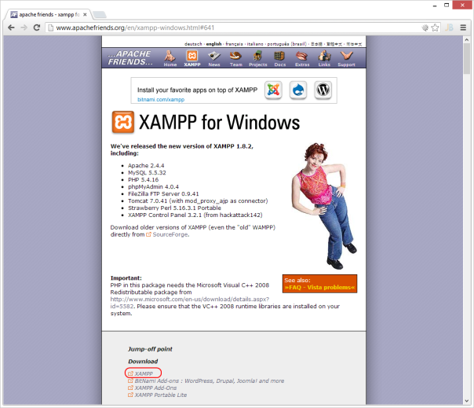

There are a number of download flavors available:

-   The **installer**, which sets up the XAMPP folder structure
-   The **ZIP** or **7zip** files, which contain all required binaries
    and configuration but don't come with a wizard to get started

We will be using the installer for now. If you do want to make use of
the ZIP or 7zip files, please run the *setup\_xampp.bat* file once the
archive is extracted.

Once the download of the installer is completed, we can run it.

### Running the XAMPP installer

Once the XAMPP installer is asked, we may be prompted with the following
notification:

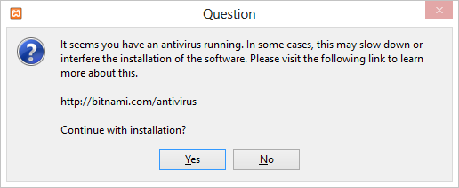

This warning can be ignored in most situations, please check the
[http://bitnami.com/antivirus](http://bitnami.com/antivirus) website for
more information.

Depending on our operating system and settings, we may also see the
following message:

If you have UAC enabled on your Windows Vista, Windows 7 or Windows 8
machine, it is recommended not to install XAMPP into the *Program Files*
folder.

### XAMPP installation wizard

The XAMPP installation wizard is pretty straightforward. Using the
**Next** button, we can navigate through all steps in the installation.

One of the first steps where input is required is the *Select
Components* step. In here, we have to specify which components we want
to install with XAMPP:

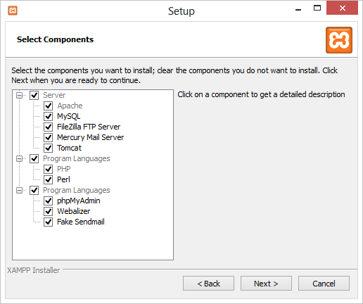

Depending on our plans, we can add/remove certain components here. To
work with PHP, we typically require Apache, MySQL (if we want to work
with a database) and PHP. Other components are utilities which may come
in handy, such as the Fake Sendmail which mimics a mail server that can
be used during development.

Next, we have to specify the installation folder. We will be using the
*c:\\xampp* folder.

After clicking the **Next** button again, all required components are
extracted to the specified folder.

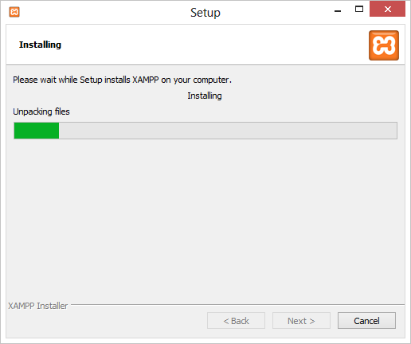

After extracting and installing all files, we can launch the XAMPP
control panel. Let's keep the checkbox ticked and use the **Finish**
button to complete installation.

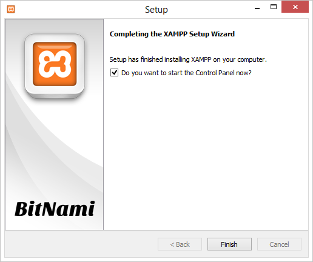

XAMPP Control Panel
-------------------

After installation, we can use the XAMPP Control Panel to perform
several actions such as starting / stopping servers and changing
configurations.

### Starting and stopping servers

To start a specific server, click the **Start** button next to them. To
stop a running server, we can use the **Stop** button. Let's start the
*Apache* server by clicking the **Start** button.

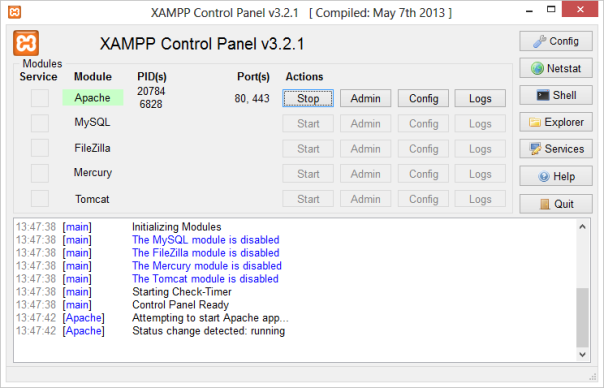

Depending on your system configuration, starting Apache may fail. If
that is the case, verify that no other software is listening on TCP
ports 80 and 443. Other web servers such as IIS may be using these
ports, as well as Skype or other software. Close these other programs
and try again, or modify the Apache configuration to listen on different
TCP ports.

### Starting a server as a Windows Service

By default, none of the servers such as Apache or MySQL are installed as
Windows Service. This means that whenever we want to make use of these
servers, we have to manually start them through the XAMPP Control Panel.

If we want to run specific servers as a Windows Service so they start
whenever Windows is started, we can open the XAMPP Control Panel as an
administrator. Next, stop the server using the **Stop** button.

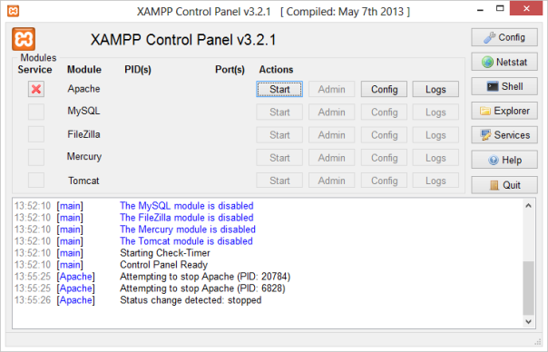

Once stopped, we can click the **X** next to the server we want to
install as a Windows Service. For example, we can install Apache as a
Windows Service. After clicking the **X**, we have to confirm
installation by clicking **Yes**.

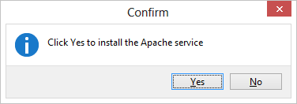

Once the installation succeeds, the server will display a green
checkmark, indicating the server is now running as a Windows Service.

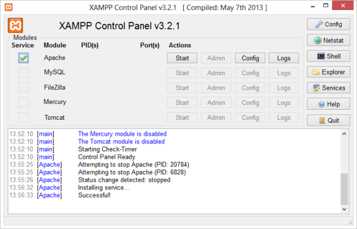

Note that we can still start and stop our servers using the button in
the XAMPP Control Panel.

Integrating XAMPP with the IDE
------------------------------

Now that we have installed XAMPP and launched its components, we need to
tell our IDE where these components are stored and how they are
configured.

### Integrating the PHP executable

Let's start by registering the PHP executable from XAMPP in PhpStorm.
When in a PHP project, we can do this using the **File | Settings** menu
***(Ctrl+Shift+S*** or ***Cmd+Shift+S*** on Mac***)***, navigating to
the **Project Settings | PHP**.

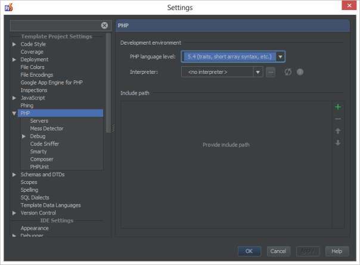

With IntelliJ IDEA and PhpStorm, we can have several separate PHP
interpreters registered in the IDE, depending on the PHP version and/or
PHP configuration needed for the project. All currently registered
installations of PHP interpreters are displayed in the **Interpreter**
drop-down list:

We can add the one we've installed with XAMPP by clicking the Browse
button (**…**). This will bring up the **Interpreters** dialog box.

1.  In the left-hand pane, click the **Add** button on the toolbar.
2.  In the **Name** text box, type the name to identify the current
    installation, for example *PHP from XAMPP*.
3.  In the **PHP Home** text box, specify the folder where the PHP
    executable file *php.exe* is stored. Since we have installed XAMPP
    to *c:\\xampp* the PHP home directory will be *C:\\xampp\\php*. We
    can enter this path manually or use the **Browse** button to find
    the path on our system.
4.  The IDE checks whether the specified folder contains a PHP
    executable file, detects the PHP version, and displays it in the
    **PHP Info** read-only field.

We can now save these settings and select the newly added PHP
interpreter for our project:

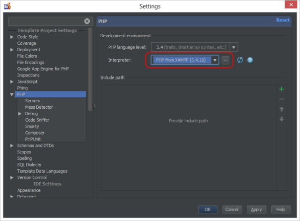

Our IntelliJ IDEA or PhpStorm IDE will now make use of the PHP
installation that was bundled with XAMPP.

### Integrating the debugger

PhpStorm offers a powerful debugger in which breakpoints can be set and
variables can be inspected at runtime. For more information on using
PhpStorm's debugger, have a look at any of the following articles:

-   [Zero-configuration Web Application Debugging with Xdebug and
    PhpStorm](http://confluence.jetbrains.com/display/PhpStorm/Zero-configuration+Web+Application+Debugging+with+Xdebug+and+PhpStorm)
-   [Xdebug Installation
    Guide](http://confluence.jetbrains.com/display/PhpStorm/Xdebug+Installation+Guide)
-   [Zend Debugger Installation
    Guide](http://confluence.jetbrains.com/display/PhpStorm/Zend+Debugger+Installation+Guide)
-   [Validating Your Debugging
    Configuration](http://confluence.jetbrains.com/display/PhpStorm/Validating+Your+Debugging+Configuration)

### Integrating the Apache server

Interaction between IntelliJ IDEA or PhpStorm with Web, FTP, and other
servers is supported through the [Remote Hosts Access
plugin](https://www.jetbrains.com/phpstorm/help/working-with-web-servers-copying-files.html),
which is enabled by default for IntelliJ IDEA and PhpStorm. The IDE
accesses servers using connection settings specified in the registered
server access configurations. These configurations are created and
managed in the **Project Settings |** **Deployment** page of the
**Settings** dialog box.

Choose **File | Settings** on the main menu again to open the
**Settings**. Click **Deployment** under the **Project Settings** node
to go to the **Deployment** page.

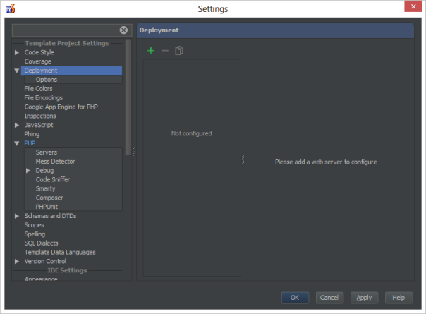

From the toolbar, click the **Add** button to add a new server. From the
**Add Server** dialog, we can specify a name for our XAMPP server and
select the deployment type. For XAMPP's Apache server, select the *Local
or mounted folder* type.

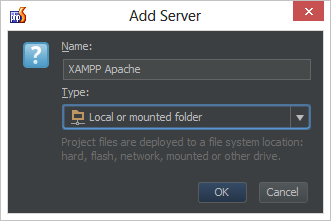

After clicking **OK**, we can specify the folder to Apache's web root
(*C:\\xampp\\htdocs*) and the URL to the web server,
*[http://localhost](http://localhost/)*. Note that these settings may be
different depending on how you have configured the XAMPP Apache server
through the *C:\\xampp\\apache\\conf\\httpd.conf* configuration file.

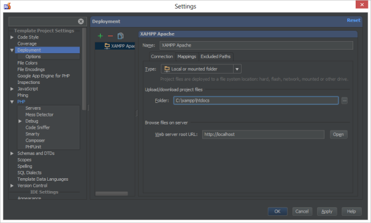

Using the **Open** button, we can verify settings are ok. Once done, we
should be seeing the XAMPP homepage.

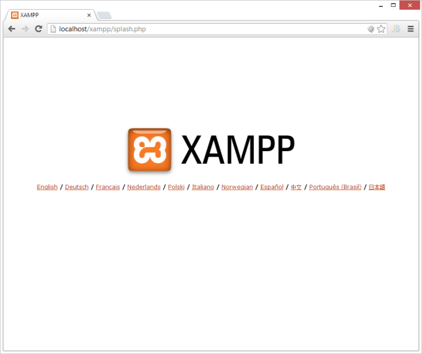

### Integrating the MySQL server

IntelliJ IDEA and PhpStorm provide us the possibility to connect to the
XAMPP MySQL database server using the Database plugin (installed and
enabled by default). First of all, make sure the MySQL server is running
from the XAMPP Control Panel.

Next, from the right-hand side of our IDE, we can open the database tool
window.

Opening the database pane, we can create a new connection or *Data
Source* by using the context menu. We'll have to specify the JDBC
database driver to be used to connect to our database. For MySQL, we can
use the *MySQL Connector* driver available in the list of drivers.
PhpStorm doesn't ship these drivers but a simple click (on *Click here*)
fetches the correct JDBC driver from the Internet.

Next, we'll have to enter our connection details. As the JDBC driver
class, select the *com.mysql.jdbc.Driver* driver. The Database URL
should be a connection string to our MySQL Database, for example
*jdbc:mysql://localhost:3306/* or *jdbc:mysql://localhost:3306/foodb* to
connect to the *foodb* database. We can also specify the username and
password for MySQL, *root* and a blank password for a standard XAMPP
installation. Note it is recommended to change the default MySQL
username and password after the XAMPP installation. This can be done
through
[http://localhost/security/xamppsecurity.php](http://localhost/security/xamppsecurity.php).

When using UTF-8 or unicode characters in the username, password or
database name, two additional parameters must be added to the connection
string: characterEncoding and useUnicode. An example connection string
would be
*jdbc:mysql://localhost:8889?characterEncoding=utf8&useUnicode=true*. It
may also be required to select a different JDBC driver from the list,
*com.mysql.jdbc.NonRegisteringDriver*.

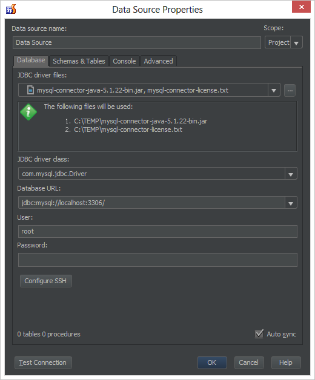

Using the **Test Connection** button, we can verify the settings and
make sure PhpStorm can connect to MySQL.

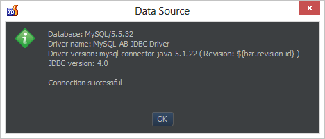

We can now create tables, run queries, update data and so on. See [this
blog
post](http://blog.jetbrains.com/webide/2013/04/working-with-windows-azure-sql-database-in-phpstorm/)
for more information.

 