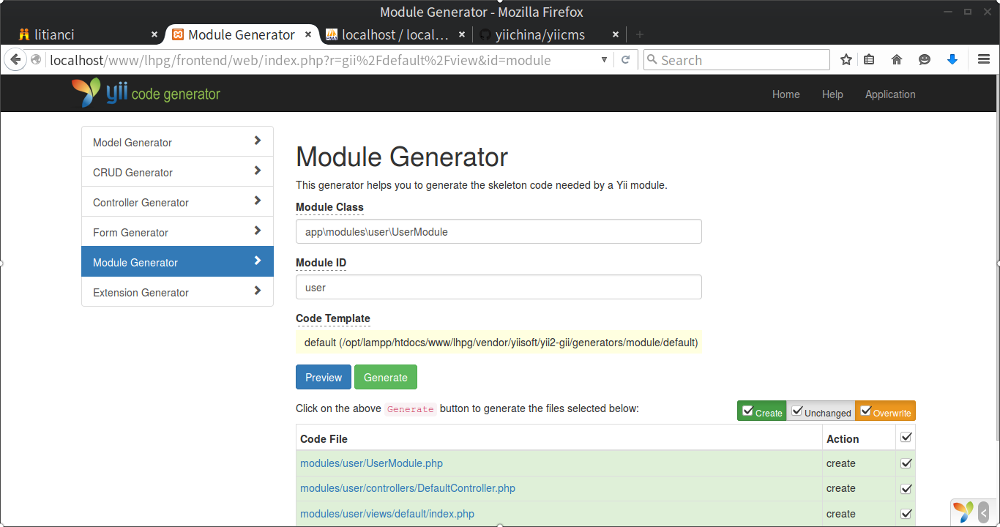

## 第十二章 学着做

### 安装yii2框架

#### 一、使用命令行安装

```bash
#进入工作根文件夹
cd /opt/lampp/htdocs/www/

# 创建yii2高级版本模板的文件夹lhpg
composer create-project yiisoft/yii2-app-advanced lhpg 2.0.6
```

#### 二、初始化模板

下面除非特殊说明，默认操作的文件夹为`/opt/lampp/htdocs/www/lhpg`。

```bash
cd lhpg # 进入要开发的文件夹
./init #初始化
```
会出现类似下面这样的内容，做出合适选择即可。

```
  Yii Application Initialization Tool v1.0
  
  Which environment do you want the application to be initialized in?
  
    [0] Development
    [1] Production
  
    Your choice [0-1, or "q" to quit] 0
  
    Initialize the application under 'Development' environment? [yes|no] y
  
    Start initialization ...
```

#### 三、加入git版本控制

现阶段只有我一人开发，暂时没必要建立复杂的git仓库管理机制。下面不涉及搭建git服务器的内容。

```bash
git init
```

查看需要跟踪哪些文件夹和文件。

```bash
git status
```

注意，已经有*.gitignore*文件了。
可以看到有很多红色的文件需要添加。可以使用如下命令，全部添加这些文件。

```bash
git add .bowerrc .gitignore LICENSE.md README.md <many files and folders>
```

添加完成后，可以使用

```bash
git status
```

再次查看，是否有没有添加进来的。

最后做该项目的初始化提交。

```bash
git commit -am "初始化网站"
```

这样就完成了该项目的版本控制的初始化。

#### 四、设计数据库的一部分

##### 1、设计用户表，`tbl_user`

考虑到基于角色设计的用户，各个角色的属性不尽相同。
比如，学员`student`跟教员`teacher`的权限等职能和属性差别太大。
但是他们又有共同的一些属性，比如登录需要记录的一些信息。
在数据表里无法实现**继承**`inheritance`，下面考虑一种变通的方式在Yii2中实现。

> 采用ActiveRecord的relations的方式，在User跟Student,Teacher
> 等之间互相索引，以解决登录统一接口跟角色不同之间的矛盾。

参考[通用后台](http://www.yiichina.com/code/344)跟[iisns](https://github.com/shi-yang/iisns)的用户表，结合现实情况，得到用户表如下。

```sql
CREATE TABLE IF NOT EXISTS `tbl_user` (
  `id` varchar(18) NOT NULL COMMENT '证件号码',
  `username` varchar(255) NOT NULL COMMENT '昵称',
  `password_hash` varchar(255) NOT NULL COMMENT '密码',
  `auth_key` varchar(32) NOT NULL COMMENT '授权密钥',
  `access_token` varchar(43) NOT NULL COMMENT '访问令牌',
  `created_at` datetime NOT NULL COMMENT '创建时间',
  `updated_at` datetime NOT NULL COMMENT '更改时间',
  `role` tinyint(2) NOT NULL COMMENT '角色',
  `last_login_at` datetime NOT NULL COMMENT '上次登录时间',
  `this_login_at` datetime NOT NULL COMMENT '本次登录时间',
  `password_reset_token` varchar(255) DEFAULT NULL COMMENT '密码重置令牌',
  `email` varchar(255) DEFAULT NULL COMMENT '邮箱',
  `status` tinyint(2) NOT NULL COMMENT '状态',
  `avatar` varchar(24) DEFAULT NULL COMMENT '照片'
) ENGINE=InnoDB DEFAULT CHARSET=utf8 COMMENT='用户表';


ALTER TABLE `tbl_user`
  ADD PRIMARY KEY (`id`),
  ADD UNIQUE KEY `username` (`username`),
  ADD UNIQUE KEY `password_reset_token` (`password_reset_token`);
```

##### 2、导入数据库，`db_lhpg`

假设数据库名字为`db_lhpg`，里面现在只有一个表`tbl_user`。下面导入该数据库。

打开文件*./common/config/main-local.php*,编辑`components['db']`。

```php
'db' => [
            'class' => 'yii\db\Connection',
            'dsn' => 'mysql:host=localhost;dbname=db_lhpg',
            'username' => '<your sql user>',
            'password' => '<your password>',
            'charset' => 'utf8',
      			'tablePrefix' => 'tbl_',
      			'enableSchemaCache' => true,
        ],
```

在xampp中创建数据库比较方便，假设读者已知，略。<span style="color: rgb(255, 0, 0);">这里有错误。</span>

#### 五、使用gii创建用户模块UserModule

在浏览器中输入网址[http://localhost/www/lhpg/frontend/web/index.php?r=gii](http://localhost/www/lhpg/frontend/web/index.php?r=gii)。

选择**Module Generator**，依次如图输入



Module Class
<table>
    <tbody>
        <tr>
            <td style="word-break: break-all; border-width: 1px; border-style: solid;" valign="top" width="484">
                app\modules\user\UserModule
            </td>
        </tr>
    </tbody>
</table>

Module ID
<table>
    <tbody>
        <tr>
            <td style="word-break: break-all; border-width: 1px; border-style: solid;" valign="top" width="484">
                user
            </td>
        </tr>
    </tbody>
</table>

点击**Generate**按钮，可能出错，查看一下，有可能是无创建文件夹权限。可以输入命令，

```bash
$ chmod a+w ./frontend
```

赋予*frontend*文件夹以写的权限。

这里解释一下为什么是*app\modules\user\UserModule*，这完全是按照页面提醒做的，然后试了一下生成代码，果然是的，就这样做了。

然后，按照页面提醒内容，修改*./frontend/config/main.php*，加入

```php

<?php
    ......
    'modules' => [
        'user' => [
            'class' => 'app\modules\user\UserModule',
        ],
    ],
    ......

```

**注意**：添加的时候，`modules`跟`components`一个层次的，